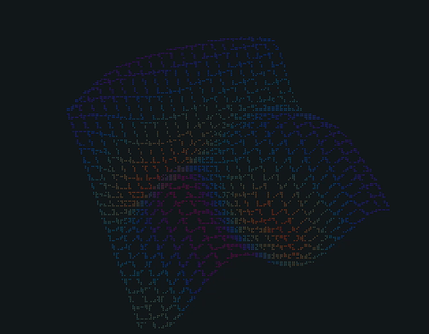

# tui-saver



[한국어 문서](README.ko.md)

A terminal screensaver that will not let the host fall asleep. Eighteen scenes —
geometric solids, demoscene effects, strange attractors, a raymarched SDF —
rendered to characters and cycled with a dissolve, while a sleep lock keeps the
display and the machine awake underneath. macOS, Windows and Linux.

No runtime dependencies.

## Install

```sh
npm i -g tui-saver
```

```sh
tui-saver              # start it
tui-saver --list       # what's in the box
tui-saver --doctor     # ask the OS whether it's really staying awake
tui-saver --help
```

Or run it out of a clone. Node executes the TypeScript directly, so there is
nothing to build:

```sh
git clone https://github.com/aciddust/tui-saver
cd tui-saver
node src/main.ts
```

Either way you need Node 23.6 or newer, where type stripping runs without a
flag. The rest of this file writes `tui-saver`; from a clone, read that as
`node src/main.ts`.

Press `?` for the key list, `q` to quit.

## Staying on one scene

The playlist advances every 22 seconds by default. Three ways to stop it:

- `**f` while it's running** — pins whatever is on screen and stops the clock.
The status bar switches to `pinned` / `f:unpin`. Press it again to resume
cycling. `n` and `p` still work while pinned, so you can step by hand.
- `**--scene <id>**` — start with only that scene, nothing to advance to.
- `**--duration 0**` — keep the whole playlist but never advance automatically;
`n` / `p` / `1`-`9` drive it.

`--only globe,fire` is the in-between case: a short playlist of just the scenes
you want, still cycling.

## Stopping by itself

Nothing bounds a run by default, and that is deliberate: the lock is held for
exactly as long as the animation is on screen, and a full-screen animation is
hard to forget about. But a run you walked away from outlives its reason, so it
can be given an end:

```sh
tui-saver --for 90m        # 90s, 45m, 2h, 1h30m
tui-saver --until 18:00    # the next 18:00 — tomorrow's, if today's has passed
```

The status bar counts down, goes amber for the last minute, and `+` adds fifteen
minutes if you are still there. With no limit it shows the other number instead:
how long this has been up, and therefore how long the machine has been kept awake.

`caffeinate -t` already does the first of these, and this is not pretending
otherwise. What it adds is the same thing on the other two platforms —
`systemd-inhibit` has no timeout option and neither does `SetThreadExecutionState`
— and a timer you can see. A countdown nobody can read is how a limit ends up
extended by guesswork.

## Not flattening the battery

`caffeinate` has no idea what it is plugged into. `-s` is the closest it comes,
and the man page says the assertion "is valid only when system is running on AC
power" — so it silently does nothing on battery, which is exactly the case where
someone shut the lid and walked off believing the machine would stay up.

The charge is read once a minute and shown in the status bar: `bat 74%⚡` on mains,
`bat 74%` when it is going down. Below `--battery-floor` **while discharging**, the
run warns for ten seconds and then releases the lock and exits — a machine at 12%
in a bag is the one outcome nothing else here would have prevented.

```sh
tui-saver --battery-floor 25   # default 15
tui-saver --battery-floor 0    # read it, show it, never act on it
```

Only a battery that is actually going down counts, so working at 8% on mains is
left alone. A machine with no battery reports none and the guard does nothing,
which is also what happens on a platform with no reader or when the query fails —
all four want the same answer.

## Staying awake

Each platform has some way to say "don't idle out while I'm running", and all
three are expressed the same way here: launch a small helper that takes the lock
and then **watches our pid**, so it releases on its own when we go away.


|         | mechanism                                                               |
| ------- | ----------------------------------------------------------------------- |
| macOS   | `caffeinate -dis -w <pid>`                                              |
| Windows | `powershell` -&gt; `SetThreadExecutionState`, then `Wait-Process <pid>` |
| Linux   | `systemd-inhibit --what=idle:sleep -- tail --pid=<pid> -f /dev/null`    |


That indirection is the whole design. A lock held by *us* leaks if we are killed
with `SIGKILL` or `TerminateProcess`, because no cleanup handler runs. A lock held
by a watcher cannot leak: the watcher notices the pid is gone, and if the watcher
itself is killed the OS drops the lock with the process. There is no path that
leaves a machine permanently unable to sleep.

### Knowing it is really held

A running watcher is not proof. The request can be refused, or dropped by
something outside this program, and the process looks identical either way. Three
things stand between "we asked" and "it is held":

- **The OS is asked again.** Every 90 seconds, with the platform's own tool —
  `pmset -g assertions`, `systemd-inhibit --list`. An answer that no longer names
  the lock fails the run even though the watcher is still alive. Being unable to
  ask is treated differently from being told no: the answer goes stale rather
  than becoming a failure.
- **A watcher that dies is replaced.** Once. A watcher that cannot stay up is a
  fact to report, not a spawn loop.
- **Failure is not hideable.** The status bar can be hidden with `h` or never
  shown at all with `--no-hud`; the warning across the top row cannot be, and the
  bell rings once when the lock is lost. A run that stopped holding what it
  promised exits 1 and says so on stderr.

The status bar grades the evidence rather than implying one answer for all three
platforms:


| label        | what it means                                                  |
| ------------ | -------------------------------------------------------------- |
| `awake✓`     | the OS itself reports the lock, recently                       |
| `awake~`     | the watcher says it holds it; nobody independent has agreed    |
| `awake…`     | the watcher is running, and that is the whole of what we know  |
| `awake:FAIL` | not holding it                                                 |


`awake~` is what Windows gets. `powercfg /requests` will not print the request
table without an Administrator prompt, and there is no unelevated way to ask
Windows about an execution-state request — so instead the watcher re-asserts the
flags on every wait iteration and prints a line each time that succeeds. Weaker
than the OS agreeing, far stronger than a live pid. It also replaced a fixed
3.5-second delay: `--doctor` used to guess how long PowerShell needed to compile
its P/Invoke shim before the lock existed to be asked about.

`--require-awake` refuses to draw anything at all unless the lock reaches `awake✓`
or `awake~`, which is what you want when wrapping work that must not be
interrupted.

`--doctor` holds the same lock and then prints the platform's own view of it, so
you never have to take this file's word for it.

### Verifying it yourself

```sh
node tools/check-awake.ts
```

Static checks of all three platforms' watcher commands, then a live check on the
current one: hold the lock against a throwaway process, ask the OS whether it is
held, kill that process outright, and confirm the watcher lets go. **Run it once
on each platform you ship to** — or let `.github/workflows/verify.yml` do it,
which runs this tool on macOS, Windows and Linux runners on every push.

On Windows the OS query (`powercfg /requests`) needs an Administrator prompt and
is reported rather than failed — but the kill test, which is the load-bearing
one, needs no elevation anywhere.

### Platform status

**macOS** — verified here. All three assertions confirmed held via
`pmset -g assertions`, and confirmed released after `kill -9`.

**Windows** — implemented but **not executed by the author**, who had no Windows
machine or PowerShell available. CI now runs `tools/check-awake.ts` on a Windows
runner; until that has gone green the job reports rather than gates. What *is* verified is everything checkable as
data: the exact UTF-16LE bytes PowerShell receives, the here-string and brace
structure, the flag values (`ES_CONTINUOUS|ES_SYSTEM_REQUIRED|ES_DISPLAY_REQUIRED`
to hold, `ES_CONTINUOUS` alone to release), and that the release runs in a
`finally`. Run `tools/check-awake.ts` on Windows before shipping.

**Linux** — same caveat: implemented against `systemd-logind`, not executed. Needs
`systemd-inhibit` on PATH, which desktop distributions have. Whether a GitHub
runner — systemd present, no graphical login session — will grant the inhibitor
is exactly what the CI job is there to find out.

### What none of them do

**Stop the screen saver.** It runs off a separate idle timer and would cover the
animation. `--defeat-screensaver` mitigates it per platform — a short
`caffeinate -u` on macOS, an `xdg-screensaver reset` on Linux, a single `{F15}`
keystroke on Windows. Best-effort: a screen lock enforced by security policy or
group policy is not something a user-space program overrides, and shouldn't be.

Note the Windows pulse is the only part of this that touches the rest of the
desktop. The keystroke code is **omitted from the generated script entirely**
unless you pass the flag, rather than being present and skipped at runtime — so
if you don't ask for it, there is nothing there to read or to scan.

**Keep a laptop awake with the lid shut.** No lock overrides clamshell sleep
unless the machine is on AC power with an external display attached.

On a platform with no backend the animation still runs; the status bar reads
`awake:n/a`.

## Windows notes

Two things bite on Windows that don't elsewhere, both fixed but worth knowing:

**Colour.** Nothing on Windows sets `TERM`, and the usual "no `TERM` means no
colour" heuristic therefore sentenced every Windows terminal to monochrome —
including Windows Terminal, which does full 24-bit. Windows is now decided before
that rule and defaults to truecolor, which both Windows Terminal and conhost have
supported since Windows 10 1703.

**Braille glyphs.** The legacy console's default font is Consolas, which has *no*
Braille Patterns coverage, so the braille scenes would render as rows of
replacement boxes. There is no escape sequence that asks a terminal about font
coverage, so it is inferred: if nothing indicates a modern host
(`WT_SESSION`, `TERM_PROGRAM`, ConEmu, WezTerm, Alacritty, or any `TERM`), the
braille scenes — and only those — are redirected to half-block mode, which keeps
sub-character vertical resolution using a glyph every font has. Everything else
renders unchanged.

Override the guess either way with `--braille` / `--no-braille`.

For the best result tell users to run it in **Windows Terminal** with Cascadia
Mono, which covers braille and does truecolor.

## Scenes


| id             | mode    | what it is                                                                      |
| -------------- | ------- | ------------------------------------------------------------------------------- |
| `torus`        | ascii   | the donut — point-sampled parametric torus, z-buffered, Lambert-shaded          |
| `cube`         | ascii   | solid cube, flat-shaded faces, only the visible faces' edges stroked            |
| `tesseract`    | braille | 4-cube rotating in the xy/zw/xw/yz planes, projected through w                  |
| `mobius`       | ascii   | one-sided surface with two-sided shading and a band that travels around it      |
| `globe`        | half    | ray-cast Earth: real coastlines, day/night terminator, city lights, ocean glint |
| `waves`        | braille | wireframe height field of interfering travelling ripples                        |
| `plasma`       | half    | five sine fields summed and read through a cyclic palette                       |
| `tunnel`       | half    | perspective-correct polar tunnel, wandering vanishing point                     |
| `starfield`    | braille | stars streaking past, with periodic warp bursts                                 |
| `metaballs`    | half    | seven blobs merging and splitting, contour-banded                               |
| `fire`         | half    | the 1993 DOOM fire algorithm, in colour                                         |
| `lorenz`       | half    | the butterfly                                                                   |
| `aizawa`       | half    | a spindle wound with a torus                                                    |
| `thomas`       | half    | cyclically symmetric, three-fold and looping                                    |
| `mandelbrot`   | half    | endless dive into the seahorse valley, smooth-iteration banded                  |
| `harmonograph` | braille | four damped pendulums inking a figure, then starting a new one                  |
| `hilbert`      | braille | space-filling curve drawing itself, refining order by order                     |
| `raymarch`     | half    | smooth-union SDF primitives with shadow and ambient occlusion                   |


## Render modes

Scenes never touch characters. They draw into a sub-character pixel grid, and the
canvas turns that into cells one of three ways:

- **braille** — 2×4 pixels per cell via `U+28xx`, so eight times the resolution
of plain text. One bit of coverage per dot and one colour per cell. Best for
line work: wireframes, curves, particles.
- **half** — 1×2 pixels per cell using `▀` with the lower pixel as the
background colour. Full colour per pixel. Best for dense fields and anything
where a smooth gradient is the point.
- **ascii** — one pixel per cell mapped onto a character ramp. Best for
luminance-shaded solids, and the only mode that says anything without colour.

Each scene declares the one it suits; `m` cycles the override live, `--mode`
forces it for everything. Braille and half-block pixels come out roughly square;
ascii pixels are twice as tall as they are wide, and the canvas exposes that
correction so a scene can draw a circle that actually looks round.

## Keys

```
n / →        next scene            m       cycle render mode
p / ←        previous scene        c       cycle palette
1-9          jump to scene         r       cycle ascii ramp
space        pause                 [ ]     slower / faster
f            pin current scene     0       reset speed
s            shuffle playlist      h       hide status bar
+            add 15m to the limit  ?       help
q            quit
```

## Options

```
playback
  --scene <id>            show only this scene
  --only <id,id,...>      restrict the playlist
  --duration <seconds>    seconds per scene (0 = never advance)   [22]
  --transition <seconds>  dissolve length                         [0.9]
  --fps <n>               target frame rate                       [32]
  --speed <n>             time multiplier                         [1]
  --shuffle               randomise the playlist order
  --for <90m|2h|1h30m>    end the whole run after this long
  --until <HH:MM>         end the whole run at this time of day

look
  --mode <braille|half|ascii>   force a render mode for every scene
  --palette <id>                mono amber green ice ember magma viridis cyber rainbow
  --ramp <classic|soft|blocks|dense>
  --color <truecolor|256|mono>  override colour depth detection
  --braille / --no-braille      override the braille-font guess (see Windows notes)
  --no-hud                      start with the status bar hidden

staying awake
  --no-awake              hold no sleep lock at all
  --require-awake         exit rather than run without a confirmed lock
  --battery-floor <pct>   end the run below this charge on battery (0 off)  [15]
  --defeat-screensaver    also declare synthetic user activity
  --doctor                report what the OS says about the lock
```

Colour depth is detected from `COLORTERM`/`TERM`/`TERM_PROGRAM` (and defaults to
truecolor on Windows, where none of those exist), and `NO_COLOR` is honoured. With
colour off, half-block scenes fall back to the ascii ramp, since a half-block cell
with no colour is just a solid block.

## Implementation notes

```
src/core/canvas.ts   pixel grid -> cells, the three render modes
src/core/screen.ts   cell diffing and ANSI output
src/core/raster.ts   projection, antialiased lines, z-buffered triangles
src/core/color.ts    palettes, packing, xterm-256 quantisation
src/core/noise.ts    hashing and a small xorshift
src/core/scene.ts    the scene contract
src/awake.ts         per-platform sleep-lock backends and --doctor
src/battery.ts       per-platform battery readers, parsers exported
src/cli.ts           the option table, usage text and parser
src/session.ts       how long a run lasts and when it stops by itself
src/ui.ts            status bar, help overlay, dissolve
src/scenes/          one file per scene
```

A few decisions worth knowing about:

**Frames are diffed, not repainted.** `Screen` keeps the last frame and emits only
changed runs, coalescing SGR sequences within a run, emitting only the half of the
colour state that changed, and tolerating short clean gaps rather than paying for
another cursor move. Colours are also quantised to 6 bits per channel, which
makes neighbouring cells in a gradient byte-identical so runs collapse — worth
15–30% and invisible in a character grid.

That gets most scenes to well under 1 MB/s at 132×38 truecolour:


|                                      | KB/frame | at 32 fps |
| ------------------------------------ | -------- | --------- |
| `tesseract` (braille, sparse)        | 6        | 0.19 MB/s |
| `torus` (ascii)                      | 17       | 0.52 MB/s |
| `globe` (half)                       | 26       | 0.82 MB/s |
| `plasma` (half, every pixel changes) | 136      | 4.2 MB/s  |


A full-screen per-pixel shader like `plasma` is the worst case and stays
expensive: every cell needs both a foreground and a background colour, and
neighbours differ too much to coalesce. Rather than chase it with coarser
quantisation, the writer drops frames when stdout has not drained — so a slow
terminal degrades to a lower frame rate instead of falling behind and smearing.
If a scene feels sluggish, `--fps 20` or `--mode ascii` cuts the traffic directly.

**The dissolve works on cells, not pixels.** That is what lets a braille scene
melt into a half-block one — neither has to know the other's mode.

**Trail-accumulating scenes normalise against their own peak.** For the
attractors, absolute brightness depends on particle count, frame rate and canvas
size at once, and any fixed gain that looks right in one terminal fills in solid
in another. Normalising against a smoothed peak makes *relative* density the
thing being drawn, which is where the structure is.

**Braille's one bit per dot drives several scene decisions.** A dense cloud
either clears the dot threshold and fills solid or falls under it and vanishes,
which is why the attractors use half-blocks and why `hilbert` caps its order by
how many pixels a grid cell actually gets.

## Dev tools

```sh
npm test          # node:test, no test dependency
node tools/snap.ts <sceneId> [--t s] [--cols n] [--rows n] [--mode m] [--frames n]
node tools/bench.ts [--cols n] [--rows n] [--frames n]
node tools/soak.ts
node tools/check-awake.ts
```

`snap` dumps one frame as plain text — how the geometry in here got debugged
without a TTY. `bench` reports median and p95 render cost per scene against the
frame budget. `soak` runs every scene in every mode at six terminal sizes,
including deliberately awkward aspect ratios, and fails on a throw, a NaN, or a
scene that drew nothing. `check-awake` is described under
[Verifying it yourself](#verifying-it-yourself) — run it per platform.

`npm i` pulls the devDependencies (typescript, `@types/node`) that
`npm run typecheck` wants. The program itself still needs nothing.

## Publishing

The npm package ships compiled JavaScript rather than the source, because Node
refuses to strip types from anything under `node_modules`
(`ERR_UNSUPPORTED_NODE_MODULES_TYPE_STRIPPING`). A globally installed package
lives exactly there, so shipping the `.ts` files would install fine and then fail
on first run.

```sh
npm run build     # tsconfig.build.json -> dist/
npm publish
```

`build` emits with `rewriteRelativeImportExtensions`, which turns the `./foo.ts`
specifiers the source uses into `./foo.js`. It is wired to `prepack`, so
`npm publish` and `npm pack` both build first. None of this affects working in
the repo, and `dist/` is not committed.

## License

MIT. See [LICENSE](LICENSE).